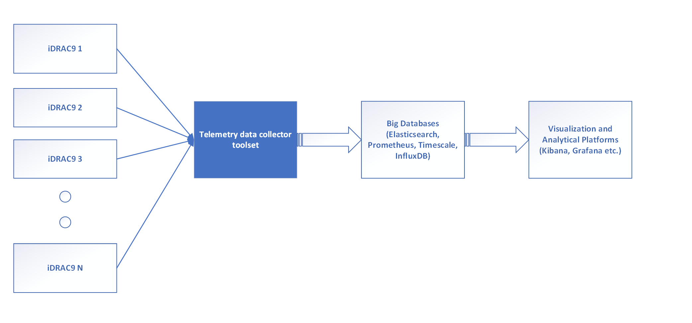

# Telemetry Reference Tools  

PowerEdge Telemetry reference toolset collects the metric reports from various devices at the PowerEdge compute and outlines a reference design to integrate with external big databases for downstream analytics and visualization.
* https://www.youtube.com/watch?v=T5ve03DB77I

PowerEdge servers with iDRAC9 version 4.00 or higher and Datacenter license can stream server telemetry data out for downstream analytics and consumption. iDRAC telemetry data simply put is a timestamped metrics that represent various datapoints about the server components and is streamed out in a format defined by the DMTF Telemetry Redfish standard. This datapoints includes information from various sensors, storage and networking subsystem and helps IT administrators better understand health and necessary details about their server infrastructure.

## Enabling Telemetry

For details on enabling telemetry and configuring reports see the [iDRAC-Telemetry-Scripting](https://github.com/dell/iDRAC-Telemetry-Scripting) API.

## Telemetry Report Types

There are currently 24 report types available. You can obtain a list by browsing to your iDRAC at `https://<iDRAC>/redfish/v1/TelemetryService/MetricReports`:

- StorageDiskSMARTData
- SerialLog
- ThermalMetrics
- MemorySensor
- GPUMetrics
- ThermalSensor
- CPURegisters
- AggregationMetrics
- GPUStatistics
- Sensor
- NICSensor
- FanSensor
- PowerMetrics
- NICStatistics
- StorageSensor
- CPUMemMetrics
- PowerStatistics
- FPGASensor
- CPUSensor
- PSUMetrics
- FCPortStatistics
- NVMeSMARTData
- FCSensor
- SystemUsage

## Prerequisites
* Go - https://golang.org/
* ActiveMQ (Message broker framework)

## Hardware and System Requirements
The toolset has been tested on PowerEdge R640 with Ubuntu 20.04.1 operating system. 

CPU - Intel(R) Xeon(R) Gold 6130 CPU @ 2.10GHz
RAM - 16GB

## Setup Instructions  

Please reference the included Docker Compose files for setup instructions.

## Understanding the API

To understand a bit more about interacting with the various API endpoints it may be helpful to look at the [GetSensorThresholds README](scripts/GetSensorThresholds/README.md)

## LICENSE
This project is licensed under Apache 2.0 License. See the [LICENSE](LICENSE.md) for more information.

## Contributing
We welcome your contributions this reference toolset. See [Contributing Guidelines](CONTRIBUTING.md) for more details.
You can refer our [Code of Conduct](CODE_OF_CONDUCT.md) here.

## Disclaimer
The software applications included in this package are  considered "BETA". They are intended for testing use in non-production  environments only. 

No support is implied or offered. Dell Corporation assumes no  responsibility for results or performance of "BETA" files.  Dell does NOT warrant that the Software will meet your requirements, or that operation of the Software will be uninterrupted or error free. The Software is provided to you "AS IS" without warranty of any kind. DELL DISCLAIMS ALL WARRANTIES, EXPRESS OR IMPLIED, INCLUDING, WITHOUT LIMITATION, THE IMPLIED WARRANTIES OF MERCHANTABILITY, FITNESS FOR A PARTICULAR PURPOSE, TITLE AND NON-INFRINGEMENT. The entire risk as to the results and performance of the Software is assumed by you. No technical support provided with this Software. 

IN NO EVENT SHALL DELL OR ITS SUPPLIERS BE LIABLE FOR ANY DIRECT OR INDIRECT DAMAGES WHATSOEVER (INCLUDING, WITHOUT LIMITATION, DAMAGES FOR LOSS OF BUSINESS PROFITS, BUSINESS INTERRUPTION, LOSS OF BUSINESS INFORMATION, OR OTHER PECUNIARY LOSS) ARISING OUT OF USE OR INABILITY TO USE THE SOFTWARE, EVEN IF ADVISED OF THE POSSIBILITY OF SUCH DAMAGES. Some jurisdictions do not allow an exclusion or limitation of liability for consequential or incidental damages, so the above limitation may not apply to you.

## Support
  * To report any issue, create an issue [here](https://github.com/dell/iDRAC-Telemetry-Reference-Tools/issues).
  * If any requirements have not been addressed, then create an issue [here](https://github.com/dell/iDRAC-Telemetry-Reference-Tools/issues).
  * To provide feedback to the development team, send an email to **idractelemetryteam@dell.com**.
