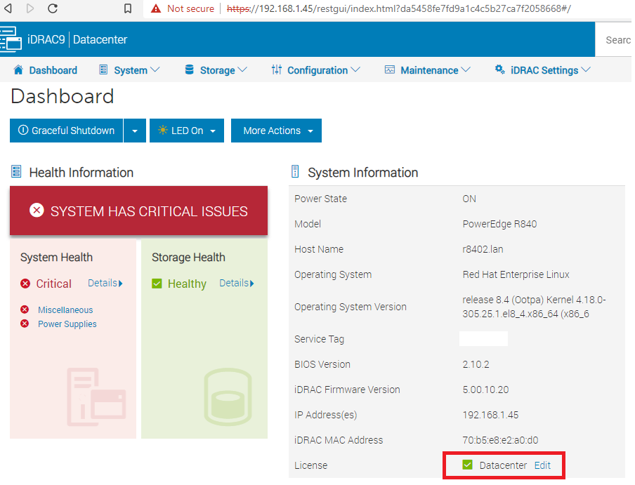

# Telemetry Reference Tools

- [Telemetry Reference Tools](#telemetry-reference-tools)
  - [Navigation](#navigation)
  - [So, what is the point of this repo?](#so-what-is-the-point-of-this-repo)
  - [What is Telemetry?](#what-is-telemetry)
  - [What do I do with telemetry data?](#what-do-i-do-with-telemetry-data)
  - [What is in this data pipeline?](#what-is-in-this-data-pipeline)
  - [Architecture Details](#architecture-details)
  - [Getting Started](#getting-started)
    - [Make Sure iDRAC is up-to-date](#make-sure-idrac-is-up-to-date)
    - [Licensing](#licensing)
    - [Enabling Telemetry](#enabling-telemetry)
    - [Hardware and System Requirements](#hardware-and-system-requirements)
  - [What to do next?/Installation](#what-to-do-nextinstallation)
  - [Post Installation](#post-installation)
  - [Debugging](#debugging)
  - [Default Ports Used by the Framework](#default-ports-used-by-the-framework)
  - [FAQ](#faq)
    - [What is the advantage of using HTTP SSE over other approaches?](#what-is-the-advantage-of-using-http-sse-over-other-approaches)
      - [Why not syslog?](#why-not-syslog)
    - [How much horsepower do I need to collect telemetry?](#how-much-horsepower-do-i-need-to-collect-telemetry)
    - [What is the output format from telemetry?](#what-is-the-output-format-from-telemetry)
    - [Do I need to worry about telemetry overwhelming the iDRAC link?](#do-i-need-to-worry-about-telemetry-overwhelming-the-idrac-link)
    - [What does a telemetry report look like?](#what-does-a-telemetry-report-look-like)
    - [Is telemetry vendor neutral?](#is-telemetry-vendor-neutral)
    - [Are there demo licenses for iDRAC Datacenter](#are-there-demo-licenses-for-idrac-datacenter)
    - [What license is required for telemetry?](#what-license-is-required-for-telemetry)
  - [LICENSE](#license)
  - [Contributing](#contributing)
  - [Disclaimer](#disclaimer)
  - [Support](#support)

## Navigation

- [Main README](README.md)
- [Architecture](docs/ARCHITECTURE.md)
- [Debugging](docs/DEBUGGING.md)
- [Install](docs/INSTALL.md)

## So, what is the point of this repo?

While it's easy to collect telemetry metrics it is not easy to build a well-structured, best-practice following, 
pipeline. We will not profess to be perfect and the totality of this code base is maintained by Dell employees in 
their spare time, but this repo is here to give people a head start in building that pipeline with a near one button
deploy mechanism to create a telemetry collection pipeline.

We tried hard to write these instructions such that things would be easy to follow. If you have feedback, especially 
if something was confusing, feel free to open an [issue](https://github.com/dell/iDRAC-Telemetry-Reference-Tools/issues)

## What is Telemetry?

Telemetry is a vendor-neutral part of the Redfish standard for providing telemetry data from a device. For more on the
Redfish standard see DMTF's [white paper](https://www.dmtf.org/sites/default/files/standards/documents/DSP2051_1.0.0.pdf). 
You can also see their [developer resources](https://redfish.dmtf.org/redfish/mockups/v1/1155). Many people first
ask, "What is in telemetry?"

Telemetry is presented by what are called reports. There are currently 24 report types available. You can obtain a 
list by browsing to your iDRAC at `https://<iDRAC>/redfish/v1/TelemetryService/MetricReports`:

- StorageDiskSMARTData
- SerialLog
- ThermalMetrics
- MemorySensor
- GPUMetrics
- ThermalSensor
- CPURegisters
- AggregationMetrics
- GPUStatistics
- Sensor
- NICSensor
- FanSensor
- PowerMetrics
- NICStatistics
- StorageSensor
- CPUMemMetrics
- PowerStatistics
- FPGASensor
- CPUSensor
- PSUMetrics
- FCPortStatistics
- NVMeSMARTData
- FCSensor
- SystemUsage

If you want to see what a report looks like check out this [sample report](scripts/GetSensorThresholds/reports.json) 
of the StorageDiskSMARTData report.

## What do I do with telemetry data?

The question most people then have is, "Well, what do I do with it?" Generally, what most people want to do is grab 
these JSON reports and push them into a time series database. This way they can monitor their systems over time for 
things like tracking load, failure prediction, anomaly detection etc. For example, maybe you want to know what times 
of day your network is most active, telemetry can tell you that. Maybe you have a group of systems failing with a 
higher frequency and you want to know why. Telemetry could tell you that everything is overheating because no one 
told you the datacenter in question was 92 degrees. Not that we have seen anyone do that *cough*.

Here is what the data might look like for you. This is what an R840 looked like during startup in Splunk analytics.


## What is in this data pipeline?

Currently, we support the following time series databases for the pipeline:

- Elasticsearch
- InfluxDB
- Prometheus
- Timescale
- Splunk (you must bring your own Splunk instance)

With the exception of Splunk, the databases for the pipeline are self deploying. With Splunk you will have to deploy 
your own instance of Splunk, but we detail how to do this in the instructions.

At its highest level the pipeline looks like this:

iDRAC telemetry -> ActiveMQ -> Time series database


There are several GoLang programs in between that provide the glue which connect all of these data pipelines. See 
the [architecture](docs/ARCHITECTURE.md) for more details.

## Architecture Details

See [ARCHITECTURE.md](docs/ARCHITECTURE.md)

## Getting Started

### Make Sure iDRAC is up-to-date

You must be running iDRAC 4.0 or higher for telemetry support.

### Licensing

The first thing you will need is the 
[Datacenter License](https://www.dell.com/support/kbdoc/en-us/000176472/idrac-cmc-openmanage-enterprise-openmanage-integration-with-microsoft-windows-admin-center-openmanage-integration-with-servicenow-and-dpat-trial-licenses) 
for iDRAC. If you do not know what license your iDRAC currently has you can check it by logging into the iDRAC and 
looking here:



If you just want to try things out you can get a trial license for your iDRACs 
[here](https://www.dell.com/support/kbdoc/en-us/000176472/idrac-cmc-openmanage-enterprise-openmanage-integration-with-microsoft-windows-admin-center-openmanage-integration-with-servicenow-and-dpat-trial-licenses). If you would like to deploy licenses to 
many servers programmatically there is an example script of how to do that in 
[Python](https://github.com/dell/iDRAC-Redfish-Scripting/blob/master/Redfish%20Python/IdracLicenseManagementREDFISH.py) and
 [Powershell](https://github.com/dell/iDRAC-Redfish-Scripting/tree/master/Redfish%20PowerShell/Invoke-IdracLicenseManagementREDFISH). 

### Enabling Telemetry

The next thing you will need to do is enable telemetry on your servers. You can either do this through the GUI or 
there is a [script available](https://github.com/dell/iDRAC-Telemetry-Scripting/blob/master/ConfigurationScripts/EnableOrDisableAllTelemetryReports.py)
that will do it programmatically. The syntax is 
`python3 ./ConfigurationScripts/EnableOrDisableAllTelemetryReports.py -ip YOUR_IDRAC_IP -u IDRAC_ADMIN -p IDRAC_PASSWORD -s Enabled` 
To do it through the GUI log into the iDRAC and go to Configuration->System Settings->Telemetry Streaming and set 
Telemetry Data Stream enabled.


### Hardware and System Requirements

Whatever server on which you decide to run telemetry reference tools will have to run the following applications:

- A few lightweight GoLang programs
- Docker
- Apache ActiveMQ
- Your time series database

The amount of resources you will need strongly depends on the number of servers from which you will create data. We 
are still in the initial phases of testing but here are some stats from a 5-minute capture of a live R840:

| Total Packets               | 2933              |
|-----------------------------|-------------------|
| Average PPS                 | 9.8               |
| Average Packet Size (Bytes) | 720               |
| Total Bytes sent/recv       | 2112629 (~2.06MB) |
| Average bytes/s             | 7056              |

As you can see from the above, the data load is very light. You could easily pull data from hundreds of servers with 
one receiver depending on its resources. As we perform more load testing we will push results here.

If you would like to perform some simple testing on your own you can pull all reports via 
[HTTP SSE](https://developer.mozilla.org/en-US/docs/Web/API/Server-sent_events/Using_server-sent_events) with the 
command:

```bash
curl -kX GET -u root:PASSWORD "https://YOUR_IDRAC_IP/redfish/v1/SSE? \$filter=EventFormatType%20eq%20MetricReport"
```

## What to do next?/Installation

After you have gone through getting started. You can head over to our [installation instructions](docs/INSTALL.md).

**NOTE:** You will need access to the internet for the initial build of the pipeline but can move it offline after 
it is built.

## Post Installation

After you have your setup running you will likely want to start customizing it to your liking. This is meant to be a 
reference architecture but it is unlikely it will do exactly what you want. You will likely want to develop your own 
dashboards, analytics setups, or tune parts of the pipeline.

## Debugging

If you need to debug things, we have included a few tips and tricks we learned along the way in 
[DEBUGGING.md](docs/DEBUGGING.md).

## Default Ports Used by the Framework

- 3000 - Grafana
- 8080 - configgui port (external). Internally it uses 8082
- 8088 - Splunk HTTP Event Listener (if using Splunk)
- 8000 - Splunk Management UI (if using Splunk)
- 8161 - ActiveMQ Administrative Interface (default credentials are admin/admin)
- 61613 - ActiveMQ messaging port. Redfish read will send to this port

## FAQ

### What is the advantage of using HTTP SSE over other approaches?

[HTTP SSE](https://developer.mozilla.org/en-US/docs/Web/API/Server-sent_events/Using_server-sent_events) consumes 
far less bandwidth than the alternate methods of obtaining telemetry data. Long pulling/Hanging GET requires a GET to 
"hang" on all iDRACs, using POST subscriptions runs the risk of no one being available to listen to the events and 
consumes more bandwidth, and syslog has a number of protocol-specific problems detailed below. 

#### Why not syslog?

The issue with the syslog protocol is that the protocol does not specify a max message size. This means that each 
syslog server implementation chooses a max message size. Furthermore, the behavior when a message exceeds the 
maximum message size is not defined. Many syslog servers simply truncate the message which is obviously not a 
desirable behavior. If you decide you really want to try to use syslog (we don't recommend this approach) a member 
of our team has written 
[a script](https://github.com/dell/iDRAC-Telemetry-Scripting/blob/master/TelemetryReportProcessingScripts/TelemetryRsysLogProcessor.py)
for reassembling the messages.

### How much horsepower do I need to collect telemetry?
See [Hardware and System Requirements](#hardware-and-system-requirements)

### What is the output format from telemetry?
JSON

### Do I need to worry about telemetry overwhelming the iDRAC link?
There is no risk that even with all reports turned on telemetry can overwhelm iDRAC's 1Gb/s link. Each report takes 
only KB/s. Even if you tune the reports to send very frequently you will not overwhelm the 1Gb/s link.

### What does a telemetry report look like?
See [this example](scripts/GetSensorThresholds/reports.json) of what a telemetry report looks like.

### Is telemetry vendor neutral?
Yes. Telemetry is part of DMTFs Redfish specification. While there are parts of the Redfish standard which are 
left to vendor implementation Dell's telemetry implementation is compliant with the specification.

### Are there demo licenses for iDRAC Datacenter
Yes. See [this website](https://www.dell.com/support/kbdoc/en-us/000176472/idrac-cmc-openmanage-enterprise-openmanage-integration-with-microsoft-windows-admin-center-openmanage-integration-with-servicenow-and-dpat-trial-licenses)

### What license is required for telemetry?
iDRAC Datacenter

## LICENSE
This project is licensed under Apache 2.0 License. See the [LICENSE](LICENSE.md) for more information.

## Contributing
We welcome your contributions to this reference toolset. See [Contributing Guidelines](docs/CONTRIBUTING.md) for 
more details. Please reference our [Code of Conduct](docs/CODE_OF_CONDUCT.md).

## Disclaimer
The software applications included in this package are  considered "BETA". They are intended for testing use in 
non-production  environments only. 

No support is implied or offered. Dell Corporation assumes no  responsibility for results or performance of "BETA" 
files.  Dell does NOT warrant that the Software will meet your requirements, or that operation of the Software will 
be uninterrupted or error free. The Software is provided to you "AS IS" without warranty of any kind. DELL DISCLAIMS 
ALL WARRANTIES, EXPRESS OR IMPLIED, INCLUDING, WITHOUT LIMITATION, THE IMPLIED WARRANTIES OF MERCHANTABILITY, FITNESS 
FOR A PARTICULAR PURPOSE, TITLE AND NON-INFRINGEMENT. The entire risk as to the results and performance of the Software
is assumed by you. No technical support provided with this Software. 

IN NO EVENT SHALL DELL OR ITS SUPPLIERS BE LIABLE FOR ANY DIRECT OR INDIRECT DAMAGES WHATSOEVER (INCLUDING, WITHOUT 
LIMITATION, DAMAGES FOR LOSS OF BUSINESS PROFITS, BUSINESS INTERRUPTION, LOSS OF BUSINESS INFORMATION, OR OTHER 
PECUNIARY LOSS) ARISING OUT OF USE OR INABILITY TO USE THE SOFTWARE, EVEN IF ADVISED OF THE POSSIBILITY OF SUCH 
DAMAGES. Some jurisdictions do not allow an exclusion or limitation of liability for consequential or incidental 
damages, so the above limitation may not apply to you.


## Support
- To report an issue open one [here](https://github.com/dell/iDRAC-Telemetry-Reference-Tools/issues).
- If any requirements have not been addressed, then create an issue [here](https://github.com/dell/iDRAC-Telemetry-Reference-Tools/issues).
- To provide feedback to the development team, email **idractelemetryteam@dell.com**.
