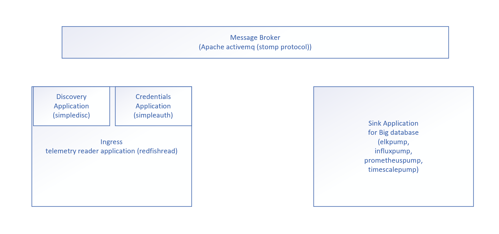

# Telemetry Reference Tools - Design Philosophy

The toolset is designed with scalability and flexibility in to consideration and can be ideally deployed as containers.

Flexibility - Major functionalities like remote source (iDRAC) discovery, credentials management for authorization, and
telemetry report processing are abstracted as separate standalone applications. All IPC are through the message bus.
Provided the IPC message interface structure is maintained, applications can be easily replaced or extended to suite the
environments these applications are targeted to use. One or more ingest applications can be run to perform metrics
ingestion into one or more database of choice.

Scalability - Additional endpoints of iDRACs can be supported by adding more containers as it is needed to support the
additional processing and data load in the environment.

Following big databases/analytics platforms are intergrated and tested with this toolset.

* ElasticSearch(ELK stack)
* Prometheus database
* Timescale Database (PostgreSQL adaptation)
* Influx DB

## Components

# idrac-telemetry-receiver

* dbdiscauth applications - Database (mysql) based discovery and authentication functions
* configgui applications - Graphical User Interface application to configure telemetry source service
* redfishread application - Make SSE (Server Sent Event) connection with each discovered data sources(iDRACs) and
  forwards the telemetry report streams to sink applications through a shared message bus connection. iDRAC Telemetry
  reports are DMTF redfish compliant.
* [Optional]simpleauth and simpledisc applications (Abstracts a file based (following the sample - config.ini)
  discovery and authentication functions

# sink applications - Read the telemetry reports from message bus and ingest the report streams into specific analytical solution.

* timescalepump - Ingest timeseries metrics into Elasticsearch database.
* influxpump - Ingest timeseries metrics into InfluxDB database.
* prometheuspump - Ingest timeseries metrics into Prometheus database.
* timescalepump - Ingest timeseries metrics into TimeScale database.

Application reads and uses following environment variables. Please refer the docker compose files for further
information.

* MESSAGEBUS_HOST
* MESSAGEBUS_PORT
* CONFIGUI_HTTP_PORT
* MYSQL_DATABASE
* MYSQL_USER
* MYSQL_PASSWORD
* MYSQL_HOST
* MYSQL_HOST_PORT 
