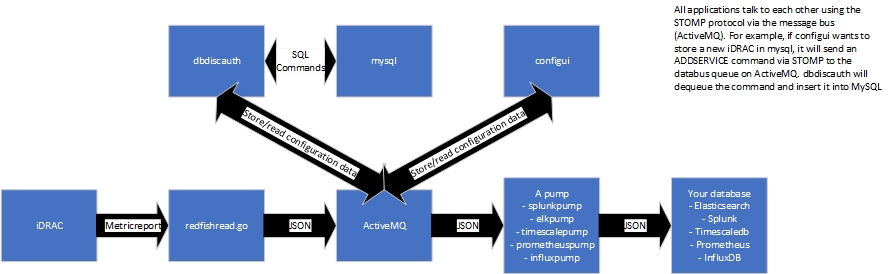

# Architecture

- [Architecture](#architecture)
  - [Navigation](#navigation)
  - [Event Flow](#event-flow)
  - [Understanding the API](#understanding-the-api)
  - [Understanding Internal Workflow](#understanding-internal-workflow)

## Navigation

- [Main README](../README.md)
- [Architecture](ARCHITECTURE.md)
- [Debugging](DEBUGGING.md)
- [Install](INSTALL.md)

## Event Flow

1. iDRAC generates a Metricreport and sends a JSON formatted message via [HTTP SSE](https://developer.mozilla.org/en-US/docs/Web/API/Server-sent_events/Using_server-sent_events) to redfishread.go
2. [redfishread.go](../cmd/redfishread/redfishread.go) in the `parseReport` function calls the `SendGroup` function 
   in [databus.go](../internal/databus/databus.go) which will ultimately send it to the queue associated with the 
   database you are using. So, for example, if you are running splunkpump it will send it to the queue /splunk on 
   ActiveMQ.
3. The pump you are using will retrieve the message from the queue (ex: /splunk), dequeue it, and then send it to 
   the associated database.

## Understanding the API

To understand a bit more about interacting with the various telemetry API endpoints it may be helpful to look at the
[GetSensorThresholds README](../scripts/GetSensorThresholds/README.md)

The official telemetry docs are available [here](https://developer.dell.com/apis/2978/versions/5.xx/docs/Tasks/3Telemetry.md)

## Understanding Internal Workflow

1. Users begins by running [compose.sh](../docker-compose-files/compose.sh). This bash script will then use 
   `docker-compose` to run the file [docker-compose.yml](../docker-compose-files/docker-compose.yml).
2. [docker-compose.yml](../docker-compose-files/docker-compose.yml) may have some syntax that is foreign to the user.
   It makes use of [Docker Compose Profiles](https://docs.docker.com/compose/profiles/) and it also uses [YAML 
   Anchors](https://support.atlassian.com/bitbucket-cloud/docs/yaml-anchors/). The first thing Docker compose will 
   do is run Docker build on any of the containers not already built per the `build` section of each of the containers
4. The containers are as follows:
   1. activemq: The message queue we use to transfer data between all containers, to and from the iDRACs, and to and from the time series database.
   2. mysqldb: This contains all of the various configurations for the pipeline. mysql provides a mechanism for persisting user settings via a named volume mount
   3. configui: Runs the frontend the user sees
   4. dbdiscauth: Responsible for servicing all requests to onboard iDRACs and iDRAC authentication. It also initializes and writes the settings to the MySQL database.
   5. redfishread: Uses [HTTP SSE](https://developer.mozilla.org/en-US/docs/Web/API/Server-sent_events/Using_server-sent_events) to read data from the specified iDRACs. It will write data to the databus by putting data in ActiveMQ's `databus` queue.
   6. A time series database container:
      1. influx: [InfluxDB](https://www.influxdata.com/)
      2. grafana: Used with InfluxDB, TimescaleDB, and Prometheus
      3. prometheus: [Prometheus](https://prometheus.io/docs/prometheus/latest/)
      4. Elasticsearch: [Elasticsearch](https://www.elastic.co/elasticsearch/)
      5. timescale: [TimescaleDB](https://docs.timescale.com/timescaledb/latest/)
   7. A pump. There will be a container called <timeseriesdb_name>pump. This is responsible for pulling data from the message queue and sending it to the time series database.

