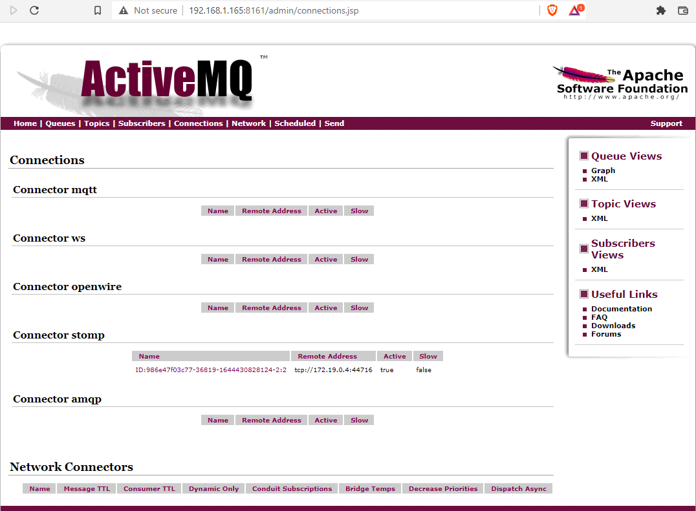
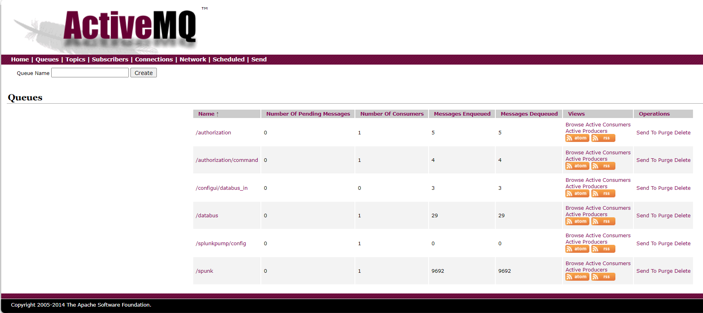

# Debugging

- [Debugging](#debugging)
  - [Navigation](#navigation)
  - [Docker](#docker)
    - [Verify docker compose version](#verify-docker-compose-version)
    - [remove stale docker containers and cleanup environment](#remove-stale-docker-containers-and-cleanup-environment)
    - [--build flag](#--build-flag)
    - [Rebuild a Single Container with Docker Compose](#rebuild-a-single-container-with-docker-compose)
    - [Keep Container Open for Debugging](#keep-container-open-for-debugging)
    - [Run a Stopped Container with a Command](#run-a-stopped-container-with-a-command)
    - [View Anonymous Containers](#view-anonymous-containers)
  - [ActiveMQ](#activemq)
    - [Check Connections in ActiveMQ](#check-connections-in-activemq)
    - [Check Message Queue](#check-message-queue)
  - [Troubleshooting Networking](#troubleshooting-networking)
  - [Splunk](#splunk)
  - [Debugging ConfigUI](#debugging-configui)

## Navigation

[Main README](../README.md)
[Architecture](ARCHITECTURE.md)
[Debugging](DEBUGGING.md)
[Install](INSTALL.md)

## Docker

### Verify docker compose version

With **docker compose v2.20.0 and above**, you may get the below error when you run `./docker-compose-files/compose.sh start`. (You will see the actual path to your repository instead of \<path-to-respository\>)

```bash
$ ./docker-compose-files/compose.sh start --timescale-test-db
Pass: Docker compose version is 2.20.3.
prometheus variable is: 
Set up environment file in <path-to-repository>/.env
To run manually, run the following command line:
docker-compose --project-directory <path-to-repository> -f <path-to-repository>/docker-compose-files/docker-compose.yml --profile core --profile timescale-test-db up  -d

no such service: influx
```
To mitigate the issue, make the following change to `docker-compose-files/docker-compose.yml`.

Delete `- influx` on [line 363](https://github.com/dell/iDRAC-Telemetry-Reference-Tools/blob/c295fe01849d67445f79945f5c1db61933b60276/docker-compose-files/docker-compose.yml#L363) and replace it with the following lines
```yml
     depends_on:
        # Paste the below lines starting at line 363 in docker-compose.yml
        influx:
         condition: service_started
         required: false
```
Run `./docker-compose-files/compose.sh start` again with the required database/pump to create the docker containers

### remove stale docker containers and cleanup environment

```bash
git clean -dfx
docker container prune -f;docker volume prune -f;
docker network ls;docker network rm idrac-telemetry-reference-tools_host-bridge-net
```

### --build flag

Changes to the containers (.go files) will only be reflected if the containers are started with the --build flag when `compose.sh` is used.
```bash
./compose.sh --build start --influx-pump
```
### Rebuild a Single Container with Docker Compose

```bash
docker-compose -f idrac-testing/docker-compose-files/splunk-docker-pipeline-reference-unenc.yml up -d --build telemetry-receiver
```

### Keep Container Open for Debugging

Go into the docker-compose file you are using to run the container and change the command to:

```bash
tail -f /dev/null
```

### Run a Stopped Container with a Command

First create a new container with `docker commit $CONTAINER_ID somename`

Next start with a new entrypoint `docker run -ti --entrypoint=something somename`

### View Anonymous Containers

If you want to view what volumes are in use when not directly specifying a volume mount you can use `docker inspect -f {{.Volumes}} <CONTAINER_ID>`
## ActiveMQ

### Check Connections in ActiveMQ

Browse to <activemq_container_ip>:8161, go to Connections and look under "Connector stomp". This will list all of the STOMP connections to the specified instance of ActiveMQ.



Here you will see connections for anything interacting with ActiveMQ.

### Check Message Queue



Depending on what pipeline you are running, you will see different results. In my case I am running Splunk so the queue of interest for me is `/splunk`. The table has the following:

- Number of Pending Messages: Messages that are in the queue but have not been processed yet
- Number of Consumers: The number of consumers monitoring this queue
- Messages Enqueued: The number of messages that have ever been pushed into this queue
- Messages Dequeued: Messages which have been dequeued by a consumer

## Troubleshooting Networking

Internal networking on Docker manifests itself as br interfaces in `ip a s`. For example, if you have something like the
elastic network you will see a bridge like this:

```bash
root@telemetrytest:~# ip a s
...
4: br-e42cb76ed747: <BROADCAST,MULTICAST,UP,LOWER_UP> mtu 1500 qdisc noqueue state UP group default
    link/ether 02:42:7f:33:25:7d brd ff:ff:ff:ff:ff:ff
    inet 172.18.0.1/16 brd 172.18.255.255 scope global br-e42cb76ed747
       valid_lft forever preferred_lft forever
    inet6 fe80::42:7fff:fe33:257d/64 scope link
       valid_lft forever preferred_lft forever
```

You can dump traffic from it with `tcpdump` to troubleshoot traffic of interest. You can also get a listing of the 
docker bridges with `docker network ls` and you can inspect that bridge with `docker network inspect <bridge_name>`

## Splunk

You can view the http event collector log at `$SPLUNK_HOME/var/log/introspection/splunk/http_event_collector_metrics.log`. By default `$SPLUNK_HOME` in our setup was `/opt/splunk`. This will tell you if the http event collector is actively receiving events.

## Debugging ConfigUI

1. In configui.go uncomment the following:

    ```golang
     // DEBUGGING
     // Uncomment this when you would like to debug configui in a standalone debugger. The issue is that the working
     // directory when in a container will have all the appropriate files. However, when running this in a debugger
     // you have to change the working directory to the appropriate directory for everything to run correctly.
     /*
     os.Chdir("cmd/configui")
     newDir, direrr := os.Getwd()
     if direrr != nil {
     }
     fmt.Printf("Current Working Directory: %s\n", newDir)
     */
    ```

2. Next you will need to comment the first two lines here and uncomment the third:

    ```golang
      stompPort, _ := strconv.Atoi(configStrings["mbport"])
      mb, err := stomp.NewStompMessageBus(configStrings["mbhost"], stompPort)
      // mb, err := stomp.NewStompMessageBus("192.168.1.165", 61613) // If debugging, uncomment and set to your system
    ```

3. Next, you will need to go into `docker-compose.yml` and on the activemq container expose port 61613 via port 
   forwarding so that your debugging machine can reach it.

    ```
    activemq:
      container_name: activemq
      image: rmohr/activemq:latest
      profiles: *optional-disable
      networks:
        - host-bridge-net
      ports:
        - "8161:8161"
        - "61613:61613"
    ```

4. Finally, you will need to redeploy activemq with the updated ports.
5. At this juncture your host will be able to reach back into your remote activemq instance while you are debugging 
   configui externally.